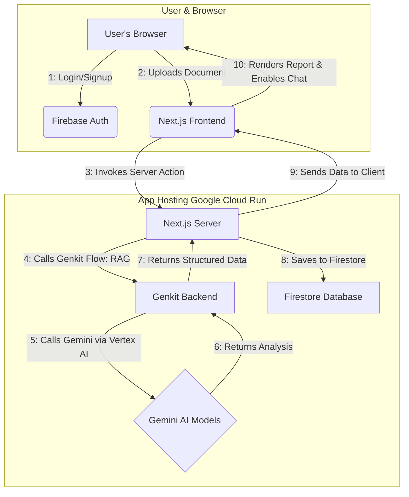
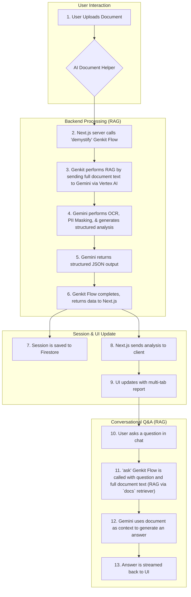
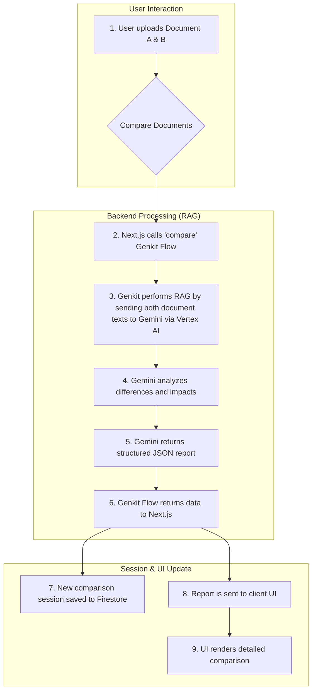

# Vidhik AI: Demystifying Legal Documents for Everyone

## 1. Vision, Social Impact & Feasibility

### The Problem Your Solution Addresses

In India, millions of people from students renting their first apartment to small business owners signing service agreements enter into legally binding contracts without fully understanding the terms. This lack of comprehension stems from two significant barriers:

1.  **Complex Legal Jargon:** Legal documents are filled with technical language that is impenetrable to the average person.
2.  **The Language Divide:** A vast number of contracts are written exclusively in English, a language not accessible to a large portion of the Indian population, which is multilingual and diverse.

This information gap puts individuals at a severe disadvantage, exposing them to financial risks, unfair obligations, and potential exploitation. The cost of hiring a lawyer to review routine documents is prohibitive for the vast majority, creating a critical need for accessible, first-line legal support.

### Your Compelling Vision & Positive Impact

**Vidhik AI** is an intelligent legal assistant designed to empower the common person by making legal documents simple, accessible, and understandable.

Our vision is to **create a future where no one is disadvantaged by a contract they couldn't comprehend.** By using the power of Generative AI, Vidhik AI acts as a private, secure, and insightful legal companion. It translates dense legal text into plain, simple English, proactively flags potential risks, and answers specific questions in a conversational manner.

This vision directly aligns with the focus area of **empowering people with access to information and opportunity**. Vidhik AI achieves this by:

*   **Promoting Financial & Legal Literacy:** By demystifying contracts, we help people understand their financial commitments (like rent, loans, and service fees) and legal rights.
*   **Reducing Financial Risk:** By flagging potentially harmful clauses and unclear deadlines, it helps users avoid costly mistakes and unfair agreements before they are signed.
*   **Bridging the Language Divide:** Our AI is designed to understand documents in major Indian regional languages. A user can upload a document in their native tongue and receive a clear, structured analysis in simple English, breaking down a significant barrier to comprehension.
*   **Democratizing Legal Understanding:** We provide a free, accessible tool that offers the kind of initial document analysis typically reserved for those who can afford legal counsel. This empowers students, gig-economy workers, renters, and small business owners to make informed decisions with confidence.

### Feasibility and Scalability

The project is highly feasible and built for scale:

*   **Feasibility:** The technical foundation is solid and uses modern, production-ready technologies. By using **Firebase Genkit** to orchestrate calls to Google's powerful **Gemini 2.5 Pro & Gemini 2.5 Flash via Vertex AI**, we can achieve a high degree of accuracy in contextual understanding and analysis right from the start.
*   **Scalability:** The entire stack is serverless. **Next.js** provides a performant frontend, **Firebase Genkit** runs in a serverless environment, and **Firebase Authentication & Firestore** automatically scale to handle a massive number of users without manual intervention. The final application is deployed globally via **Google Cloud Run**.

## 2. Opportunity and Unique Value Proposition

### How is Vidhik AI different from existing solutions?

While other document analysis tools exist, Vidhik AI is uniquely positioned for the Indian context:

*   **Hyper-Localized & Multilingual:** Our primary differentiator is the deep integration of multilingual capabilities. Users can upload a document in a regional Indian language and receive analysis in simple English, breaking down barriers that generic tools cannot.
*   **Privacy-First with OCR:** Recognizing that many older documents exist only as physical copies, Vidhik AI includes OCR to extract text from scanned images. Crucially, it also automatically detects and masks Personally Identifiable Information (PII) for user privacy.
*   **Action-Oriented & Interactive:** We go beyond simple summarization. The "Jargon Buster," categorized "Risk Analysis," and the ability to export deadlines to a calendar provide actionable insights. The conversational Q&A turns a static report into a personalized legal consultation.
*   **Full Session Management:** The platform provides a complete user experience with secure authentication, persistent session history, and a document gallery for easy access to past work.

### USP (Unique Selling Proposition)

**Vidhik AI is the first privacy-centric legal assistant designed for India's linguistic diversity, transforming complex legal documents in any major regional language or even scanned images into simple, actionable insights that anyone can understand and act upon with confidence.**

## 3. Project Functionalities & Features

### Brief About the Prototype
The prototype is a fully functional web application that allows users to sign up, log in, and access the core features of Vidhik AI. When a user uploads a document, the system processes it and transforms the interface into a multi-tab view displaying the **Summary, Risk Analysis, Jargon Buster, and Original Document**. This dashboard also enables users to **chat with their document**, asking specific questions to get instant, context-aware answers.

### 1. AI Document Helper
*   **Flexible Document Input:** Supports uploading text-based files (`.txt`, `.pdf`, `.docx`), direct text pasting, and image uploads (`.png`, `.jpg`) for scanned documents.
*   **OCR & PII Masking:** For image-based uploads, automatically extracts text and masks sensitive personal information to protect user privacy.
*   **Multilingual Analysis:** Accepts documents in English and major Indian regional languages, with all output provided in clear English.
*   **Multi-Tab Analysis Report:**
    *   **Feature Summary:** A high-level overview in markdown.
    *   **Risk Analysis:** Identifies and categorizes risks (High, Medium, Low). Users can manually adjust the risk level for any clause.
    *   **Jargon Buster:** A glossary of complex legal terms with simple definitions.
    *   **Obligations & Deadlines:** Extracts key dates and allows for calendar export (`.ics` file).
    *   **Original Document:** A viewer for the original file.
*   **Conversational Q&A (RAG Implementation):**
    *   An interactive chat interface is available after the initial analysis.
    *   This feature uses **Retrieval-Augmented Generation (RAG)**. When a user asks a question, the full text of their document is passed to the AI model as the primary context.
    *   This forces the AI to generate answers *exclusively* from the provided document, preventing it from inventing information or using external knowledge. This ensures that the answers are highly relevant and grounded in the user's specific legal text.
*   **Download Original:** Allows users to download the original document they uploaded.

### 2. Compare Documents
*   **Side-by-Side Upload:** An interface to upload two document versions for comparison.
*   **Detailed Difference Report:** Generates a report of **New Clauses**, **Changed Terms**, and **Deleted Clauses**, explaining the practical impact of each modification.

### 3. User & Session Management
*   **Secure Authentication:** Users can sign up and log in with email and password via Firebase Authentication.
*   **Session History:** Automatically saves all analysis and comparison sessions to the user's private account. Users can view and reload past sessions from the history panel.
*   **My Documents:** A gallery of all unique documents a user has ever uploaded, allowing for quick access to start new analysis sessions.

### 4. Information & FAQ
*   A dedicated, accessible page explaining all features, answering common questions, and detailing the "how-to" of the application to ensure users can get the most out of the platform.

## 4. Technical Implementation & Architecture

### Technologies Used
*   **Frontend:** Next.js (App Router), React, TypeScript
*   **UI:** Tailwind CSS, ShadCN UI
*   **AI Backend:** Firebase Genkit
*   **AI Models:** Google's Gemini 2.5 Pro & Gemini 2.5 Flash via Vertex AI
*   **Database:** Firestore (for storing user session history)
*   **Authentication:** Firebase Authentication (Email/Password)
*   **Deployment:** Google Cloud Run (containerized deployment)

### RAG Implementation Details
The core of Vidhik AI's intelligence relies on a direct and effective implementation of Retrieval-Augmented Generation (RAG).

1.  **Contextual Grounding**: For every AI task (demystification, comparison, Q&A), the *entire text content* of the user's document(s) is passed directly to the model as part of the prompt. This serves as the "retrieval" source.
2.  **Genkit's `docs` Retriever**: For the conversational Q&A feature, the `ask` flow wraps the document text in a `Document.fromText()` object. This object is passed to the `ai.generate()` call via the `docs` parameter. This signals to Genkit and the Gemini model to treat this text as the primary source of truth for "retrieval."
3.  **In-Prompt Instructions**: The prompts are engineered with critical instructions for the AI to base its answers *exclusively* on the provided document context, ensuring factual accuracy and preventing hallucinations.

This approach simplifies the architecture while ensuring that every piece of analysis is directly traceable to the source document, providing a reliable and trustworthy user experience.

### Architecture & Process Flow Diagrams

#### High-Level Architecture


#### Process Flow: AI Document Helper


#### Process Flow: Compare Documents


## 5. Detailed Instructions for Judges to Access and Test

### Accessing the Live Solution

1.  **Navigate to the URL:** Please open the provided application URL in your web browser.
2.  **Create an Account:** You will be directed to the login page. Please **Sign Up** with an email and password to create a secure account.
3.  **Login:** Log in with your newly created credentials to access the application dashboard.

### Local Setup Instructions

To run and test the application on your local machine, please follow these steps:

1.  **Prerequisites:**
    *   **Node.js:** Ensure you have Node.js (v18 or newer) installed.
    *   **Google Cloud CLI:** Install the `gcloud` CLI.

2.  **Clone the Repository:**
    ```bash
    git clone https://github.com/RD500/VidhikAI.git
    cd VidhikAI
    ```

3.  **Authenticate with Google Cloud:**
    *   Open your terminal and run the following command to log into your Google Account:
    ```bash
    gcloud auth login
    ```
    *   This will open a browser window for you to complete the login process. This step is crucial for authenticating with Vertex AI.

4.  **Create Environment File:**
    *   In the root of the project directory, create a new file named `.env.local`.
    *   Add the following lines to the file, replacing `<your-gcp-project-id>` with your actual Google Cloud Project ID:
    ```
    # Google Cloud Configuration for Genkit/Vertex AI
    GOOGLE_CLOUD_PROJECT="<your-gcp-project-id>"
    GOOGLE_CLOUD_LOCATION="us-central1"

    # Firebase Configuration
    # Replace with your project's Firebase config values.
    # You can find these in the Firebase Console: Project settings > General > Your apps > Web app
    NEXT_PUBLIC_FIREBASE_API_KEY="<your-api-key>"
    NEXT_PUBLIC_FIREBASE_AUTH_DOMAIN="<your-auth-domain>"
    NEXT_PUBLIC_FIREBASE_PROJECT_ID="<your-project-id>"
    NEXT_PUBLIC_FIREBASE_STORAGE_BUCKET="<your-storage-bucket>"
    NEXT_PUBLIC_FIREBASE_MESSAGING_SENDER_ID="<your-messaging-sender-id>"
    NEXT_PUBLIC_FIREBASE_APP_ID="<your-app-id>"
    ```


5.  **Enable APIs:**
    *   In your Google Cloud project, enable the following APIs. You can do this via the Google Cloud Console UI or by using the `gcloud services enable` command.
        *   **Vertex AI API** (`aiplatform.googleapis.com`)
        *   **Cloud Build API** (`cloudbuild.googleapis.com`)

6.  **Install Dependencies:**
    ```bash
    npm install
    ```

7.  **Run the Development Server:**
    ```bash
    npm run dev
    ```

8.  **Access the Application:** Open your browser and navigate to `http://localhost:9002`. You can now sign up and use the application as described in the testing scenarios below.

### Deployment Instructions

To deploy the application to Google Cloud Run, use the following command from the root of the project directory. Ensure your `gcloud` CLI is configured to use the correct Google Cloud project where you enabled the APIs.

```bash
gcloud run deploy vidhik-ai --source . --region us-central1 --allow-unauthenticated
```
This single command builds the container image using Cloud Build and deploys it to Cloud Run. The `--allow-unauthenticated` flag makes the service publicly accessible.

### Testing Scenarios

#### Scenario 1: Demystify a Scanned Rental Agreement (Image/OCR)

1.  **Navigate:** From the sidebar, ensure you are on the **"AI Document Helper"** screen.
2.  **Upload Image:** Use the **"Scanned/Image"** tab to upload an image of a sample rental agreement.
3.  **Analyze:** Click "Demystify Document". The analysis will start automatically after the upload.
4.  **Review the Report:**
    *   Check the **"Feature Summary"** tab for a clear, high-level overview.
    *   Go to the **"Risk Analysis"** tab. Note the AI-assigned risk levels. **Change the risk level** for one of the clauses from "Medium" to "High" using the dropdown.
    *   Explore the **"Jargon Buster"** to understand complex terms.
    *   Visit the **"Obligations & Deadlines"** tab. Click **"Export to Calendar"** to download an `.ics` file.
    *   Click the **"Original Document"** tab to see the image you uploaded.
5.  **Ask Questions (RAG in action):**
    *   The chat interface will now be active. Ask a specific question about the document, for example:
        *   "What is the notice period for terminating the lease?"
        *   (In Hinglish) "Security deposit kab wapas milega?"
    *   Verify that the AI provides a relevant answer based on the document's content.

#### Scenario 2: Analyze a Text-Based Document (PDF/DOCX)

1.  **Navigate:** Click "New Session" if needed, and select **"AI Document Helper"**.
2.  **Upload File:** In the **"Upload File"** tab, upload a text-based document like a `.pdf` or `.docx` file of a sample contract.
3.  **Analyze & Review:** Click "Demystify Document" and review the generated **Summary** and **Risk Analysis**.

#### Scenario 3: Analyze a Pasted Text Snippet

1.  **Navigate:** Click "New Session" and choose **"AI Document Helper"**.
2.  **Paste Text:** Select the **"Paste Text"** tab. Copy and paste a few paragraphs of any legal text (e.g., from a website's terms of service).
3.  **Analyze:** Click the **"Demystify Text"** button.
4.  **Review:** Briefly review the generated **Summary** and **Risk Analysis**.

#### Scenario 4: Compare Two Versions of a Contract

1.  **Navigate:** Click **"Compare Documents"** in the sidebar.
2.  **Upload Documents:**
    *   In the "Document A" slot, upload an original contract file (e.g., a `.docx` or `.pdf`).
    *   In the "Document B" slot, upload a modified version of the same contract (e.g., change the rent amount, add a new clause, or remove one).
3.  **Compare:** Click the **"Compare Documents"** button.
4.  **Review the Comparison Report:**
    *   Examine the generated report which should clearly list any **New Clauses**, **Changed Terms**, and **Deleted Clauses** in the accordion sections.

#### Scenario 5: Check History and My Documents

1.  **View History:** After performing the tests above, click the **History icon** in the top-right corner of the header. The side panel should show a list of your recent sessions.
2.  **Switch Sessions:** Click on a previous session in the history panel. The application state should update to show the documents and results from that session.
3.  **Navigate:** Click **"My Documents"** in the main sidebar.
4.  **Verify:** You should see cards representing each unique document you uploaded during your testing. Clicking on one of these cards will start a new "AI Document Helper" session with that document.

#### Scenario 6: Explore the Info & FAQ page

1.  **Navigate:** Click **"Info & FAQ"** in the main sidebar.
2.  **Review:** Read through the feature descriptions and frequently asked questions to understand the full capabilities of the application.
3.  **Test CTA:** Click one of the "Try Vidhik Now" or "Get Started" buttons, which should open the "New Session" dialog.
